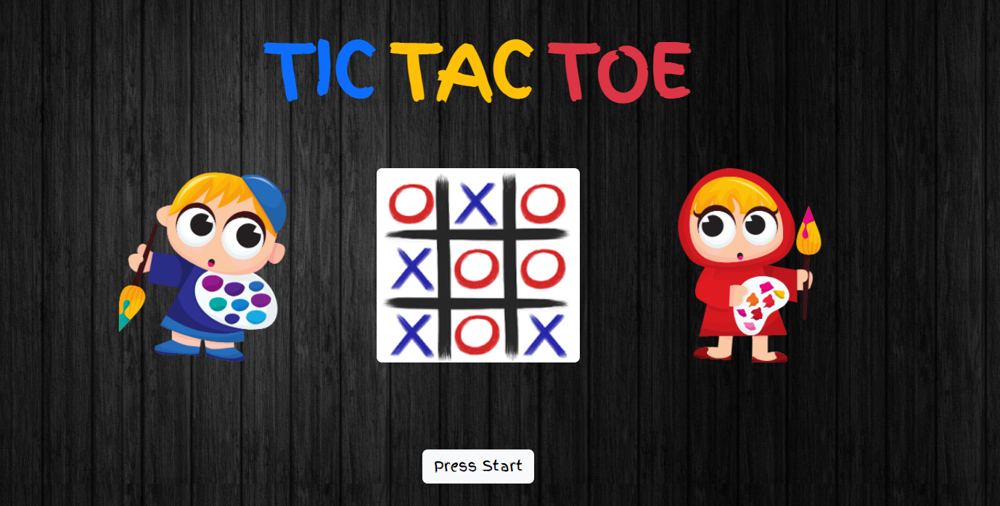
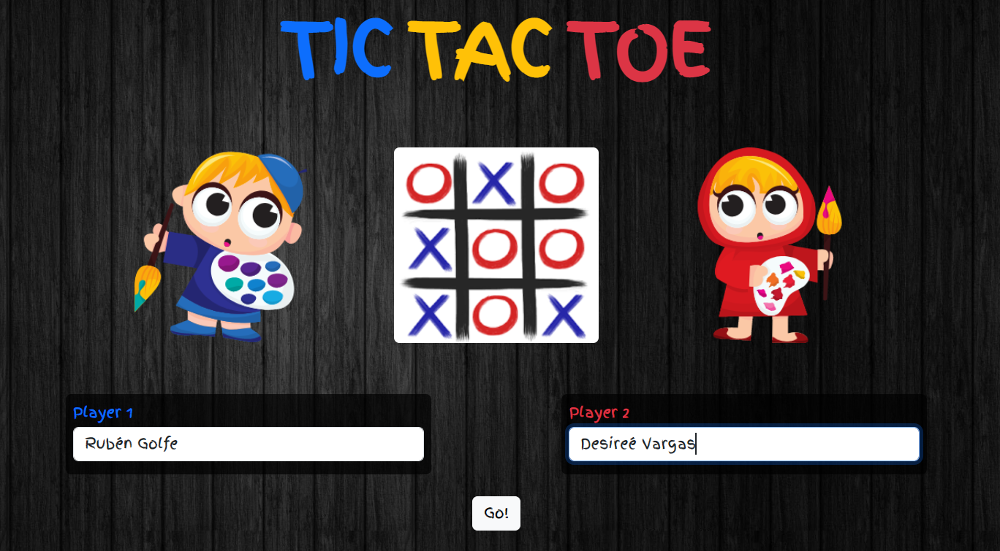
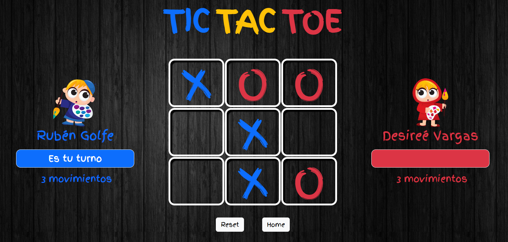
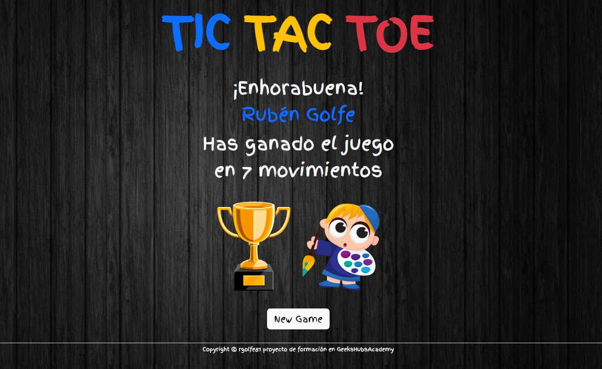

#  JUEGO TIC-TAC-TOE

## Descripción del proyecto
El proyecto consiste en replicar el juego Tic-Tac-Toe. Donde dos jugadores podrán enfrentarse en una partida con tres fichas, en la que tendrán que conseguir colocar sus tres fichas en linea antes que el contrario.
El juego dispone de cuatro vistas:
-   Inicio
-   Selección de jugadores
-   Tablero de juego
-   Ganador del juego

## Tecnologías
Estos son los lenguajes utilizados:

## Funcionalidades
1. En la página inicio consta del nombre del juego, el logo del mismo, los avatares de los dos jugadores y el botón de empezar el juego.

 

2.  En la página de selección de jugadores, podremos incluir los nombres de ambos jugadores simpre que se cumplan las siguientes restricciones:
    -   No se podrán dejar los nombres en blanco.
    -   No se podrán usar números como nombre de jugador.
    -   No se podrán usar nombre de más de 20 caracteres.

 

3.  La pantalla de juego, consta de un tablero central de nueve celdas, donde el jugador 1 colocará hasta 3 fichas con el símbolo "X" de color azul. El jugador 2 intentará hacer lo mismo en su correspondiente turno, intentando hacer tres en raya antes que el jugador contrario. Cuando los dos jugadores tengan sus tres fichas en el tablero, deberán recoger una de sus fichas y colocarla en una celda distinta hasta que uno de los dos gane la partida.
Durante el juego se contabilizarán los movimientos de cada jugador y se mostrará a cada jugador su turno.
En esta pantalla se dispone del botón "Reset" donde se podrá reinicializar la partida con todos los valores a cero. También podremos volver a la pantalla de inicio con el botón "Home".

 

4. Finalmente, cuando uno de los dos jugadores consiga su "tres en raya", el juego mostrará una pantalla de jugador ganador con:
   1.  El nombre del jugador que ha ganado
   2.  Los movimientos con los que ha ganado la partida
   3.  El avatar del jugador ganador

